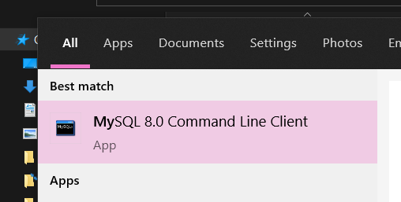
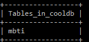
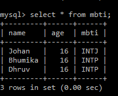

# How to mysql
Assuming you have MySQL Command Line Client already, launch it and enter your credentials


<br><br>

# Databases and Tables
So in MySQL there's literally two things- `Databases` and `Tables` <br>
Imagine a database as a server room and tables as the servers. The server is where you keep the actual data.

```json
{

 "Database1" : {

                "Table1": ["tableData"], // -> Data goes here
                "Table2": ["tableData"] // -> And here

                },

 "Database2" : {
                
                "Table3" : ["tableData"] 
                // You cannot use Table1 from Database2
    
                }

}
```
<br><br>
## Databases
So before a server, you'll need a server room. We'll create a database for that ->
```sql
CREATE DATABASE cooldb; -- this is a comment, and that is a cool db
``` 
suppose you don't like the database, you can delete it or in sql language- **drop it**
```sql
DROP DATABASE cooldb; -- ";" will end the query, it won't stop until a stopper like ;
```
great so now we can create and delete databases.

you can use `SHOW DATABASES` to see all active databases.
```sql
SHOW DATABASES
```


and now we walk into the server room, because you can't build servers in the server room without being in it.
```sql
USE cooldb; -- we let sql know we're using cooldb and the tables in it.
```

you may now only access the tables in the database `cooldb`, if there are any

So this is an empty, lonely server room with no servers in it. You'll have to make a table, this table will hold the actual data.
<br><br>

## Tables
 (It doesn't actually look like that)

A table is literally a table with rows and columns like the science practical manual observation tables <br>
Let's say I wanna make a table with person's `name`, `age` and  `mbti`. I want it to look like this:

```
+----------+-------+-------+
|  name    |  age  |  mbti |
+----------+-------+-------+
| Johan    |   16  |  INTJ |
| Bhumika  |   16  |  INTP |
| Dhruv    |   16  |  INTP |
+----------+-------+-------+
```
So let's create a table called `mbtitb` with these columns ->
```sql
CREATE TABLE mbtitb (
    name varchar(255),
    age int(255)
);
```
Wait wait wait- what's `varchar` and `int`? <br>
In python we have data types like string, list, dictionary, integer etc. In SQL we have more low-level data types like `varchar` (a string) and `int` (an integer). <br>

In `varchar(255)`, 255 represents the maximum number of characters in the string. <br>
In `int(255)`, 255 repesents the display width of the integer column and it cannot go over 255. <br>
It may seem confusing at first but you'll get used to the datatypes pretty quickly. [Here's a handy guide](https://www.w3schools.com/sql/sql_datatypes.asp)

So back to the topic, we made **a table**! Let's have a look at all the tables in the database.
```sql
SHOW TABLES
```
 <br>

Again, if you don't like it (it makes you angry) you can drop it
```sql
DROP TABLE mbtitb
```

It seems we have forgotten to add a column, oh no! Fret not we can simply add another column to this table
```sql
ALTER TABLE mbtitb
ADD mbti varchar(255);
```

So at last, you have a server in the server room. Now let's actually use the table.

<br><br>

# CRUD
**Create Read Update Delete** is the standard way of operating on databases but who cares. There's basically four main things you can do with tables. <br><br>
## Create data
So now we'll actually put stuff in the table.
```sql
INSERT INTO mbtitb (name,age,mbti)
VALUES ("Johan",16,"INTJ");
```
We can add multiple things at once:
```sql
INSERT INTO mbtitb (name,age,mbti)
VALUES ("Bhumika", 16, "INTP"), ("Dhruv",17,"INTK");
```
Good job! We've made the table.. oh dear it seems we've made an error with `Dhruv's` data. However will we change this? <br>
**UPDATE statement:** *Don't worry, I'm here to the rescue*
<br><br>

## Update data

Let's say we want to change `Dhruv's` mbti to `INTP` and age to `16`. How do we tell the machine where to look and what to update? Let's try putting it in basic english. Like this:

*Update the table mbtitb and set the value of mbti to "INTP" and set the value of age to 17 where the person's name is "Dhruv"*

So putting this into sql-talk,
```sql
UPDATE mbtitb
SET mbti = "INTP", age = 16
WHERE name = "Dhruv";
```
It's as easy as that! We updated two `column` values for a `row`.
<br><br>

## Read data

Great so we've made the table and everything's perfect. Only thing left to do now is to actually see the data. Let's read the table `mbtitb`

```sql
SELECT * FROM mbtitb
```


There it is! We chose to see all the data from all the columns because we used `*`. <br>
In general programming `*` refers to "everything" and we used it here to get all the `columns` from `mbtitb`

To see a specific column, like `mbti` we do
```sql
SELECT mbti FROM mbtitb
```

<br>

## Delete data

Let's say we wanna remove a specific row like `Bhumika's` row.
```sql
DELETE FROM mbtitb WHERE name = "Bhumika"
```
What this statement does is delete every row that matches the condition `name = "Bhumika"`. If there was another row named Bhumika it would be deleted too.
<br><br>

# That's it.


You are now a MySQL pro. Well done

Not really, this is just the basics. There's some advanced stuff that we'll only need for computer exams so yeah you can just read the textbook cuz its easier.

Also https://www.w3schools.com/sql/ has most SQL functions and has helped me quite a bit.
